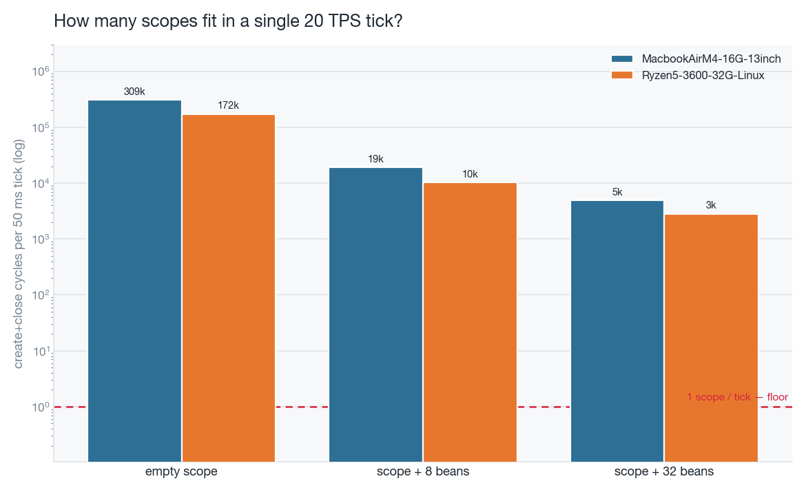
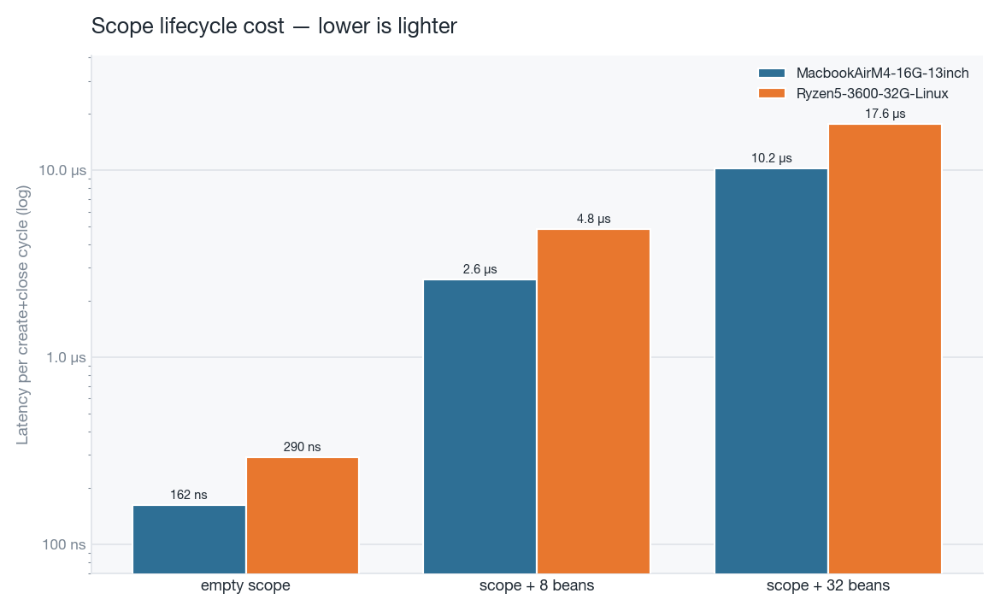
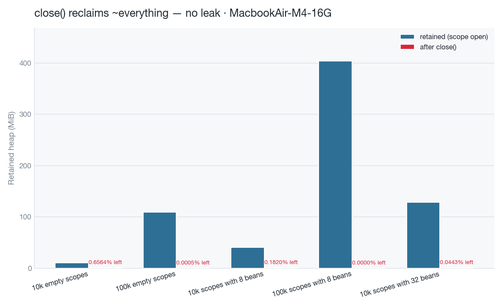
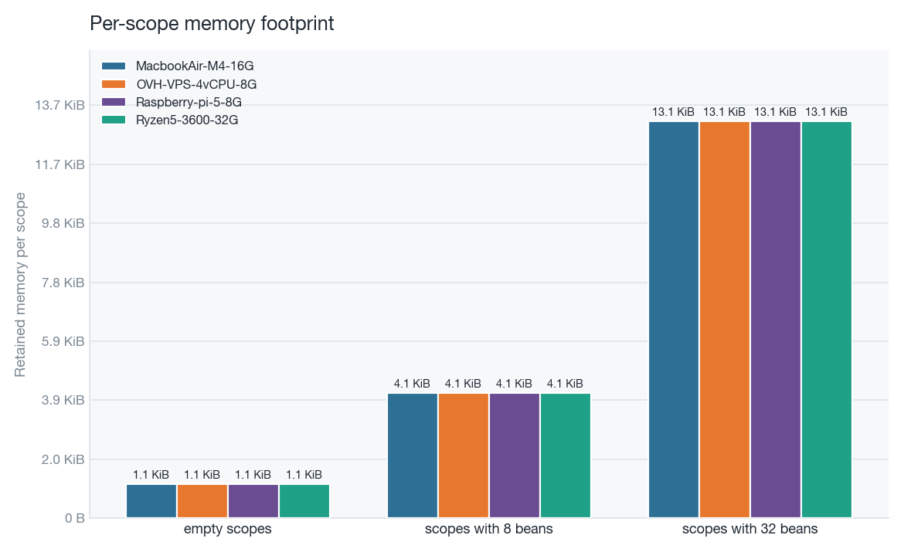
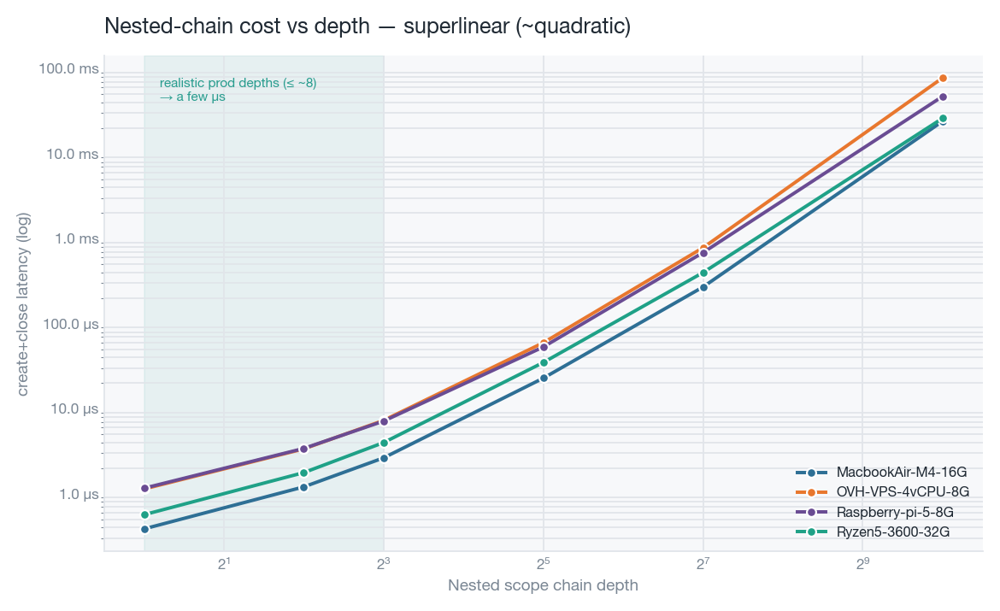
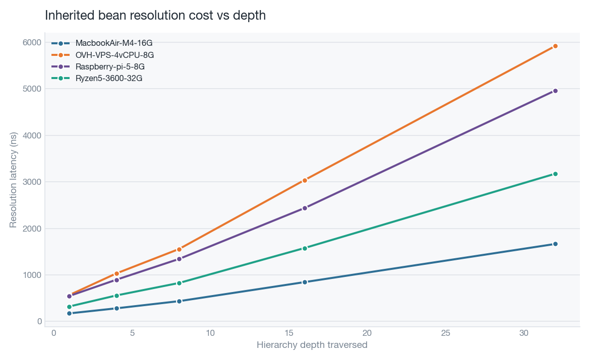
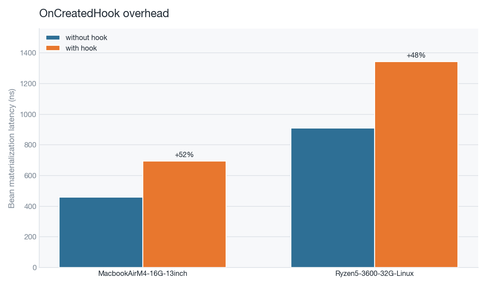

# `scope` benchmark results

Derived analysis used to assess whether the [`scope`](../scope/README.md) DI
container is lightweight enough for production use (game servers,
request/session/tenant scoping).

Each benchmark is run on several machines, combined into CSVs, and turned into
the charts below. The reference production budget used throughout is **one
game-server tick = 50 ms (20 TPS)**.

## Charts

### Scopes per tick — the headline



How many full create+close scope lifecycles fit in a single 50 ms tick. Even a
heavyweight scope (32 beans) allows a few thousand per tick; an empty scope,
hundreds of thousands. The DI cost is a rounding error against the tick budget.

### Cost per scope



Absolute latency of one create+close cycle: ~160 ns empty, ~2.6 µs with 8
beans, ~10 µs with 32 beans (Apple M4). Per-scope cost, normalised across the
10k/100k batch sizes.

### Memory: no leak after `close()`



Retained heap while a scope is open vs. after `close()`. On the large runs the
remaining heap is ~0.0005 % — `close()` reclaims essentially everything, which
is the key property for a long-running server creating scopes continuously.

### Per-scope memory footprint



Retained memory divided by scope count: ~1.1 KiB for an empty scope, ~4 KiB
with 8 beans. 100k concurrent scopes ≈ 110–400 MiB.

### Scaling with nesting depth



create+close cost of a nested scope chain vs. depth (log-log). The curve is
**superlinear (~quadratic)** — worth noting honestly. Realistic hierarchies are
shallow (≤ ~8 levels, green zone), where the cost stays in the low microseconds;
the expensive tail (depth 128–1024) is not representative of production.

### Inherited bean resolution vs depth



Cost of resolving a bean inherited through the parent chain, by traversed depth.
Grows roughly linearly per level — another reason to keep scope hierarchies
shallow.

### `OnCreatedHook` overhead



Bean materialization with vs. without an `OnCreatedHook`. The overhead is
bounded (~+50 %) and the absolute cost stays sub-microsecond.

## Caveats

- Compare absolute latencies only across machines with the **same JDK and the
  same JMH Blackhole mode** (current runs use `compiler`).
- Different CPU architectures (e.g. an ARM Raspberry Pi vs. x86) make absolute
  cross-machine timing comparisons approximate; prefer per-machine reasoning and
  ratios.
- These are microbenchmarks: read them as comparative signals, not absolute
  production SLAs.

## How these were produced

Two steps: parse the per-machine reports into CSVs, then derive metrics and
render charts.

```bash
# 1. Parse the reports into combined CSVs
python3 results/export_csv.py    # -> results/jmh.csv, results/memory.csv

# 2. Compute derived metrics and render charts
uv run --with matplotlib --with pandas python3 results/analyze.py
#   -> results/analysis_*.csv
#   -> results/charts/*.png
```

Both scripts **auto-discover machines** from the per-machine report files. Add a
new machine's reports under `results/` and re-run — it appears in every CSV and
chart automatically, with a stable colour.

| File | Content |
|---|---|
| `results/export_csv.py` / `results/analyze.py` | Generation scripts |
| `results/jmh.csv` / `results/memory.csv` | Parsed measurements, one row each |
| `results/analysis_*.csv` | Derived metrics (per-scope cost, per-scope memory, hook overhead) |
| `results/charts/*.png` | Rendered charts |
